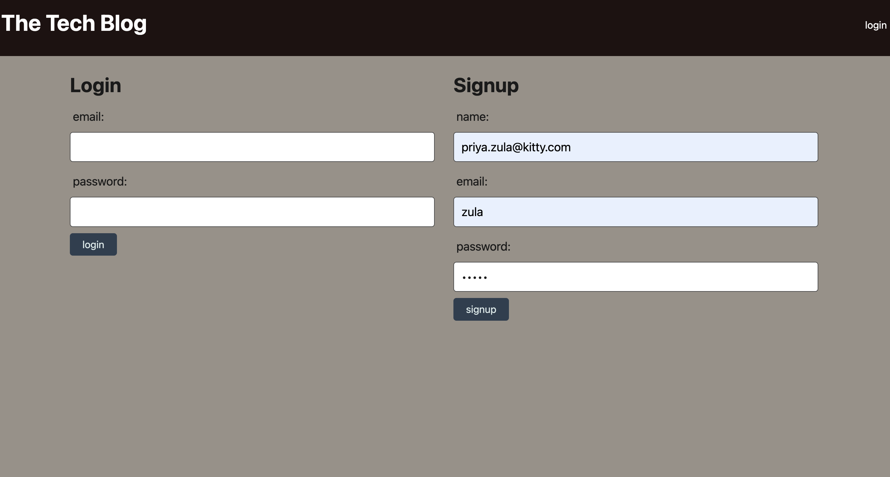

# Tech-Blog-MVC

[](https://opensource.org/licenses/MIT)


This is a blog site similar to a Wordpress site, where developers can publish their blog posts and comment on other developers’ posts as well. The blog follows a MVC paradigm in its architectural structure, using Handlebars.js as the templating language, Sequelize as the ORM, and the express-session npm package for authentication.


## Github URL and link to the video

- GitHub URL : https://github.com/priyarizal/tech-blog-MVC


## Code Snippets
 - Sequelize

 ```
const seedingUsers = () => User.bulkCreate(userSeedData,{individualHooks: true }) 
  
module.exports = seedingUsers;

 ```
 ```
const seedDatabase = async () => {
  await sequelize.sync({ force: true });

  await seedingUsers();
  console.log("users seeded");

  await seedingPost();
  console.log("posts seeded");

  await seedingComment();
  console.log("comments seeded");

  process.exit(0);
};

seedDatabase();
 ```

 ```
 router.get('/dashboard', withAuth, async (req, res) => {

  try {
    const postData = await Post.findAll({
      include: [{ model: User }],
    });
   

    res.status(200).json(postData);
    console.log()
  } catch (err) {
    res.status(500).json(err);
  }
});

router.post('/', withAuth, async (req, res) => {
  try {
    const newPost = await Post.create({
      ...req.body,
      user_id: req.session.user_id,
    });

    res.status(200).json(newPost);
  } catch (err) {
    res.status(400).json(err);
  }
});
```
```
Post.belongsTo(User, {
    foreignKey: 'user_id',
    onDelete: 'CASCADE'
});

//post hasMany comments
//Ale can make many comments
Post.hasMany(Comment, {
    foreignKey: "post_id",
    onDelete: "CASCADE",
});

//  Ale can have many comments
User.hasMany(Comment, {
    foreignKey: "user_id",
    onDelete: "CASCADE",
});

//comments 
Comment.belongsTo(Post, {
    foreignKey: "post_id",
});

Comment.belongsTo(User, {
    foreignKey: "post_id",
});
```

## Technologies Used
- JavaScript
- Node.js
- NPM
- Express.js
- MySQL2
- Sequelize
- dotenv
- handlebars


## Screenshots


## License
MIT

## Questions
If you have any questions about the project, please feel free to reach me at priya.rizal2@gmail.com